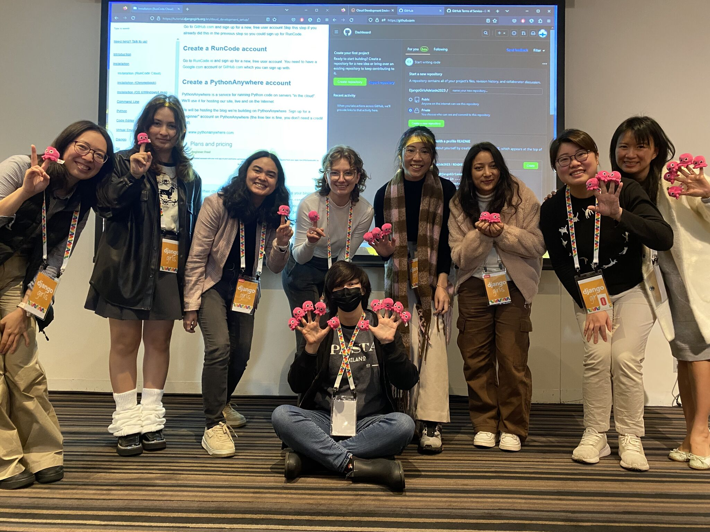
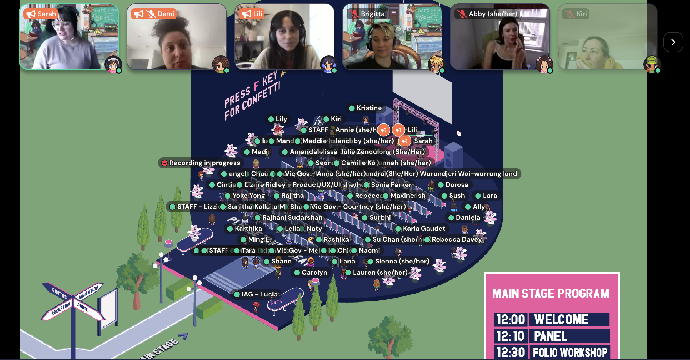

Breadcrumb: You are viewing: Tech Community | [Click me to Hackathon](/Hackathon.md) | [Click me to Portfolio](/index.md)

---

## Conference

---
### AdelaideDDD2023

DDD Adelaide is a one-day, inclusive, non-profit conference that brings together the Adelaide software community for knowledge exchange and collaboration.

I really liked Sammy Herbert's talk! They were all about making sure more awesome women stick around and grow in techie jobs. Sammy knows the scoop, having thrown cool events for techie gals. They say, "Hey, we need everyone to cheer on our techie ladies!" It's like a big, fun team that helps boost and celebrate women in tech.

---
### PyCon2023

Participating in PyCon2023, a premier conference for Python enthusiasts, provided an immersive experience to showcase my data expertise.

---
### 2023 Australian Digital Inclusion Index Launch
Infoxchange staff were invited in-person to the 2023 Australian Digital Inclusion Index Launch attended by staff members Pankaj Chhalotre, Head of Connecting Up, and Catherine McIntyre, Community Information and Volunteer Coordinator. The invitation was extended to Data Analytics Team Volunteers Camille Sze Pui Ko, Govinda Gurung, and Intern Jordana Izquierdo.

---

## Community

---

### 42 Adelaide

As an active member of 42 Adelaide, a coding community fostering collaborative learning, I showcased my software engineering skills through project collaboration, time management, and programming projects.

---
### Code Like Girl

As an intern in Code Like Girl, an organization empowering women in technology, I had the privilege to join their career fair, panel discussions, and make friends with like-minded girls.

---
### SACommunity / ConnectingUp / Infoxchange

My volunteer journey with SACommunity, ConnectingUp, and Infoxchange showcased my ability to leverage data for community impact with my skillset in data and AI.

---
### Microsoft Student Accelerator

As a participant in the Microsoft Student Accelerator program, I honed my skills and contributed to data-centric projects, showcasing my abilities in technical presentations and utilizing Azure cloud services.

---
### Breakfast Club @ Student Care @ Youx @ Uni Adelaide

As a staff member in the Breakfast Club at Student Care, alongside collaboration with Youx and the University of Adelaide, I not only contributed to fostering a supportive community but also showcased my skills and soft skills in Organizational Skills, Communication and Collaboration, and Leadership.

---
### Bootcamp @ Akkodis
Participated in the intensive Bootcamp at Akkodis, where I honed my data skills and demonstrated proficiency by earning a certificate on Azure.

---

Breadcrumb: You are viewing - Tech Community | [Click me to Hackathon](/Hackathon.md) | [Click me to Portfolio](/index.md)

---

Page template forked from <a href="https://github.com/evanca/quick-portfolio">evanca</a>

<!-- Remove above link if you don't want to attribute -->
