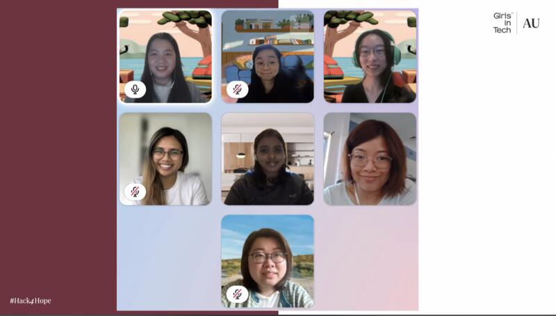

breadcrumb > You are viewing : Hackathon | [Click me to Portfolio](/index.md) | [Click me to Tech Community](/Community.md)

---

## Hackathon 

### GovHack 2023 Adelaide: RoosTrip

Participated in the GovHack 2023, a 72-hour event focusing on data solutions using open government data competition.

Challenge: Increase visitor expenditure through Smart Tourism + Highlight the diversity of South Australia’s tourism product through gamification

Proposal: Leveraging digital innovation, our app enhances tourist experiences with personalized trip planning, cashback rewards, and cultural gamification. By extending stays and encouraging local spending, we amplify visitor engagement and economic growth while showcasing the diversity of South Australia's attractions. Our dynamic app rolls out in different phrases.

My Role: Developer and analyst in the team. Additionally, I managed administrative tasks and handled video responsibilities.

<iframe width="560" height="315" src="https://www.youtube.com/embed/EjiI16aQEPI?si=uyHbDSV90_Yjwsw_" title="YouTube video player" frameborder="0" allow="accelerometer; autoplay; clipboard-write; encrypted-media; gyroscope; picture-in-picture; web-share" allowfullscreen></iframe>

View the [code](/gov_hack_2023) here. 

---

### Hack4Hope by Girl in Tech Australia: Orygen_Digital

Challenge: App Revamp for Enhanced User Engagement (Teenagers with Mental Illness in Australia)

Proposal: Our objective is to transform the current app to create a more engaging and supportive environment for teenagers dealing with mental illness in Australia. The revamped app will prioritize user-friendly interfaces, personalized features, and seamless access to mental health resources. Through this initiative, we aim to significantly enhance user engagement and contribute to the well-being of the target demographic.

My Role: Contributing to the technical implementation of the app revamp, actively participating in brainstorming sessions, and preparing presentation slides to effectively communicate our strategy.

Achievement: Orygen_Digital, our project, won the People's choice award!! We developed an MVP that includes innovative features like a text-based chatbot for emotional expression and a graphic story builder for visual communication, along with the potential for leveraging generative AI for text-to-image transformation.

---

### Adelaide MedTech Hackathon by ThincLab: Salud MedAI

Challenge: Develop solutions for medical visual question answering to address medical challenges.

Proposal: Our team at the Adelaide MedTech Hackathon is committed to combining computer vision and natural language processing modalities to address medical challenges through Salud MedAI.

My Role: Contributed to developing innovative solutions for medical visual question answering.

View the [slides](/pdf/Salud_MedAI.pdf) here. 
---
breadcrumb > You are viewing : Hackathon | [Click me to Portfolio](/index.md) | [Click me to Tech Community](/Community.md)

---

Page template forked from <a href="https://github.com/evanca/quick-portfolio">evanca</a>

<!-- Remove above link if you don't want to attribute -->
