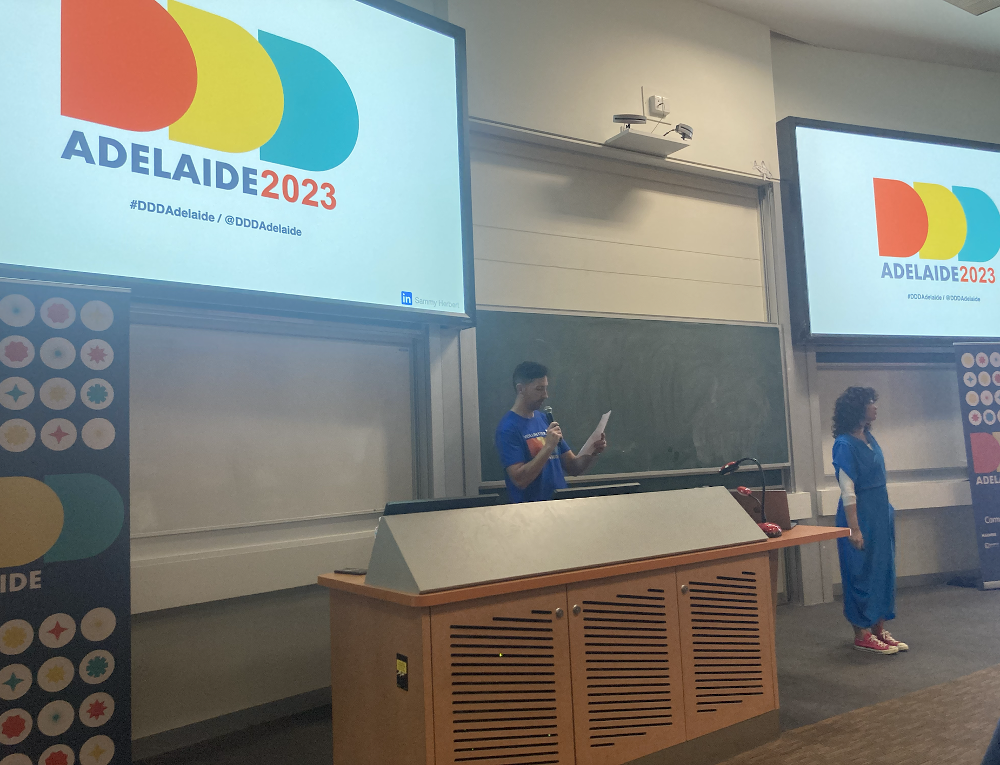
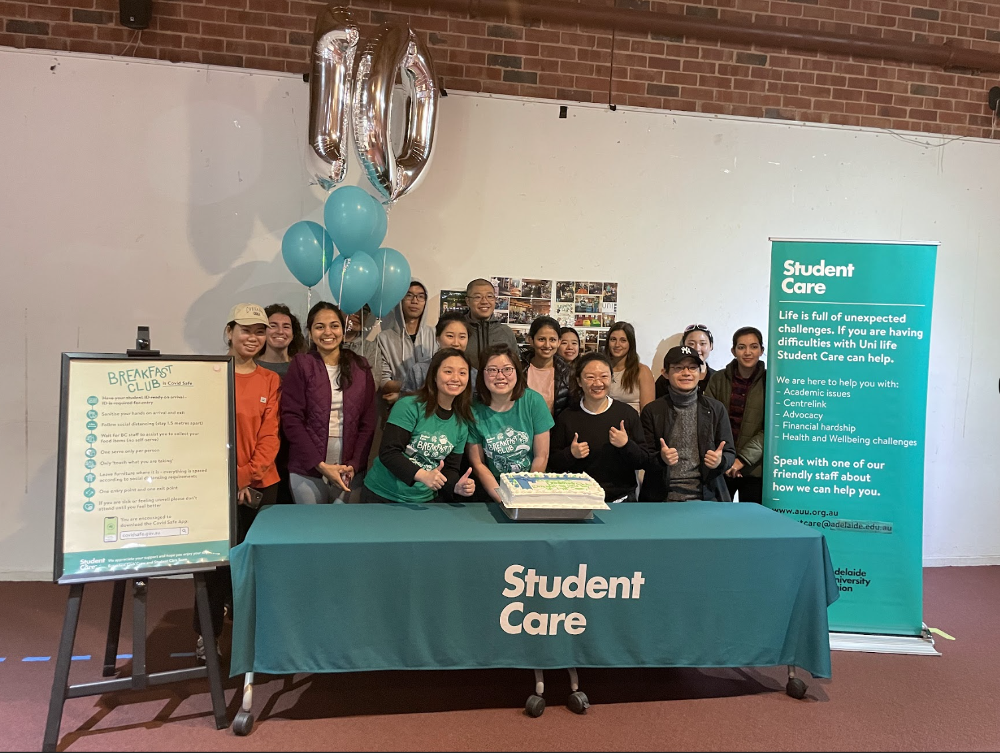

breadcrumb > You are viewing : Conference-Community-Hackathon | [Click me to Portfolio](/index.md)

---

<table>
  <tr>
    <th colspan="3" style="text-align:center;font-weight:normal;">Navigate To Anchor:</th>
  </tr>
  <tr>
    <td> <a href="#community">Community</a></td>
    <td> <a href="#hackathon">Hackathon</a></td>
    <td> <a href="#certificate_award">Certificates/Awards</a></td>
  </tr>
 
</table>

---

# Certificates/Awards 

AWS Certified Cloud Practitioner (CLF-C01) | Microsoft Certified Azure AI Engineer Associate (AI-102) | Microsoft Certified Azure Power BI Data Analyst Associate (DP-300) | Microsoft Certified Azure Data Fundamentals (DP-100) | Microsoft Certified Azure AI Fundamentals (AI-900) | Tableau Certified Analyst & Scientist

---

# [Conference](#conference)

---
### DDDAdelaide2023

DDD Adelaide is a one-day, inclusive, non-profit conference that brings together the Adelaide software community for knowledge exchange and collaboration.

I really liked Sammy Herbert's talk! They were all about making sure more awesome women stick around and grow in techie jobs. Sammy knows the scoop, having thrown cool events for techie gals. They say, "Hey, we need everyone to cheer on our techie ladies!" It's like a big, fun team that helps boost and celebrate women in tech.

---
### PyCon2023

Participating in PyCon2023, a premier conference for Python enthusiasts, provided an immersive experience to showcase my data expertise.

---
### 2023 Australian Digital Inclusion Index Launch
Infoxchange staff were invited in-person to the 2023 Australian Digital Inclusion Index Launch attended by staff members Pankaj Chhalotre, Head of Connecting Up, and Catherine McIntyre, Community Information and Volunteer Coordinator. The invitation was extended to Data Analytics Team Volunteers Camille Sze Pui Ko, Govinda Gurung, and Intern Jordana Izquierdo.

---

# [Community](#community)

---

### 42 Adelaide

As an active member of 42 Adelaide, a coding community fostering collaborative learning, I showcased my software engineering skills through project collaboration, time management, and programming projects.

---
### Code Like Girl

As an intern in Code Like Girl, an organization empowering women in technology, I had the privilege to join their career fair, panel discussions, and make friends with like-minded girls.

---
### SACommunity / ConnectingUp / Infoxchange

My volunteer journey with SACommunity, ConnectingUp, and Infoxchange showcased my ability to leverage data for community impact with my skillset in data and AI.

---
### Microsoft Student Accelerator

As a participant in the Microsoft Student Accelerator program, I honed my skills and contributed to data-centric projects, showcasing my abilities in technical presentations and utilizing Azure cloud services.

---
### Breakfast Club @ Student Care @ Youx @ Uni Adelaide

As a staff member in the Breakfast Club at Student Care, alongside collaboration with Youx and the University of Adelaide, I not only contributed to fostering a supportive community but also showcased my skills and soft skills in Organizational Skills, Communication and Collaboration, and Leadership.

---
### Bootcamp @ Akkodis
Participated in the intensive Bootcamp at Akkodis, where I honed my data skills and demonstrated proficiency by earning a certificate on Azure.

---
# [Hackathon](#hackathon)

---

### GovHack 2023 Adelaide: RoosTrip

Participated in the GovHack 2023, a 72-hour event focusing on data solutions using open government data competition.

Challenge: Increase visitor expenditure through Smart Tourism + Highlight the diversity of South Australia’s tourism product through gamification

Proposal: Leveraging digital innovation, our app enhances tourist experiences with personalized trip planning, cashback rewards, and cultural gamification. By extending stays and encouraging local spending, we amplify visitor engagement and economic growth while showcasing the diversity of South Australia's attractions. Our dynamic app rolls out in different phrases.

My Role: Developer and analyst in the team. Additionally, I managed administrative tasks and handled video responsibilities.

  <iframe
    style="position: absolute; top: 0; left: 0; width: 100%; height: 100%;"
    src="https://www.youtube.com/embed/EjiI16aQEPI?si=uyHbDSV90_Yjwsw_"
    title="YouTube video player"
    frameborder="0"
    allow="accelerometer; autoplay; clipboard-write; encrypted-media; gyroscope; picture-in-picture; web-share"
    allowfullscreen
  ></iframe>

View the [code](/gov_hack_2023) here. 

---

### Hack4Hope by Girl in Tech Australia: Orygen_Digital @ [MOST](https://www.orygen.org.au/Clinical-Care/Clinical-services/most/hellomost#:~:text=MOST%20is%20available%20to%20young,headspace%20centre%20or%20specialist%20service.)

Challenge: App Revamp for Enhanced User Engagement (Teenagers with Mental Illness in Australia) 

Proposal: Our objective is to transform the current app to create a more engaging and supportive environment for teenagers dealing with mental illness in Australia. The revamped app will prioritize user-friendly interfaces, personalized features, and seamless access to mental health resources. Through this initiative, we aim to significantly enhance user engagement and contribute to the well-being of the target demographic.

My Role: Contributing to the technical implementation of the app revamp, actively participating in brainstorming sessions, and preparing presentation slides to effectively communicate our strategy.

Achievement: Orygen_Digital, our project, won the People's choice award!! We developed an MVP that includes innovative features like a text-based chatbot for emotional expression and a graphic story builder for visual communication, along with the potential for leveraging generative AI for text-to-image transformation.

View the [slides](/pdf/Team_Orygen.pdf) here.

---

### Adelaide MedTech Hackathon by ThincLab: Salud MedAI

Participated in the Adelaide MedTech Hackathon which is an intensive innovation program that is open to all South Australian tertiary students and the general public with a focus on Healthcare Waste and Medical Dilemmas.

Challenge: Develop solutions for medical visual question answering to address medical challenges.

Proposal: Our team at the Adelaide MedTech Hackathon is committed to combining computer vision and natural language processing modalities to address medical challenges through Salud MedAI.

My Role: Contributed to developing innovative solutions for medical visual question answering.

View the [slides](/pdf/Salud_MedAI.pdf) here. 

---

| Navigate To Anchor:                   |                              |                             |
|------------------------------|--------------------------------------|--------------------------------------|
| [Conference](#conference) | [Community](#community)     | [Hackathon](#hackathon) |   

---

breadcrumb > You are viewing : Conference-Community-Hackathon | [Click me to Portfolio](/index.md)

---

Page template forked from <a href="https://github.com/evanca/quick-portfolio">evanca</a>

<!-- Remove above link if you don't want to attribute -->
