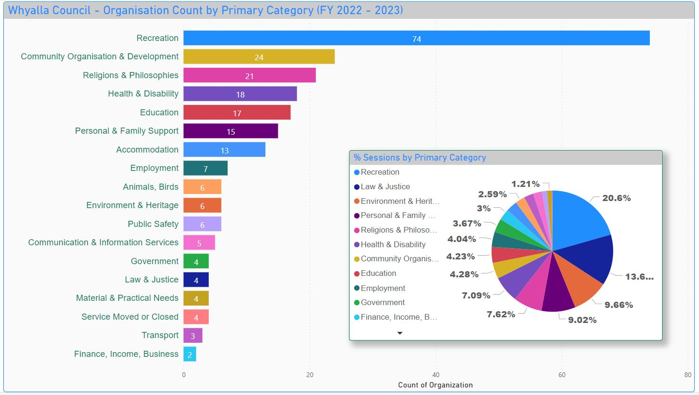
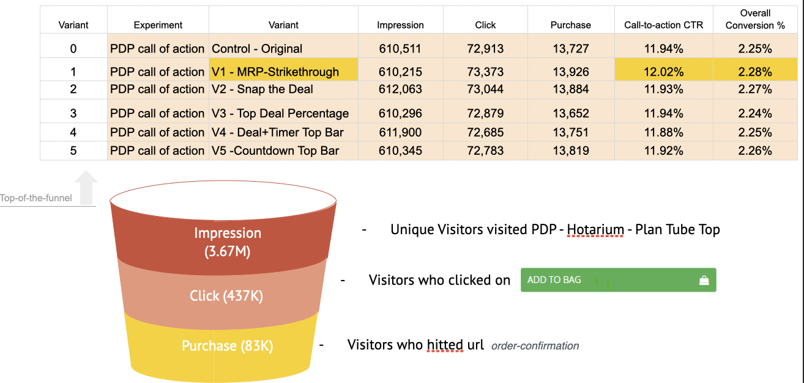
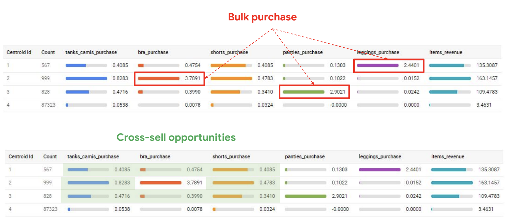
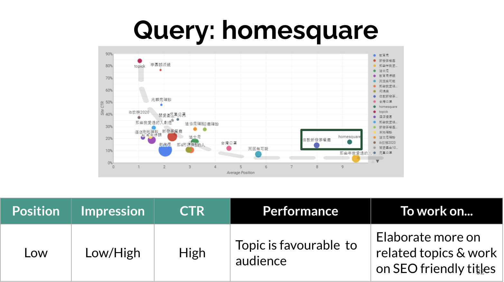
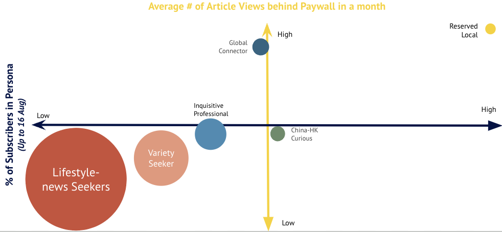
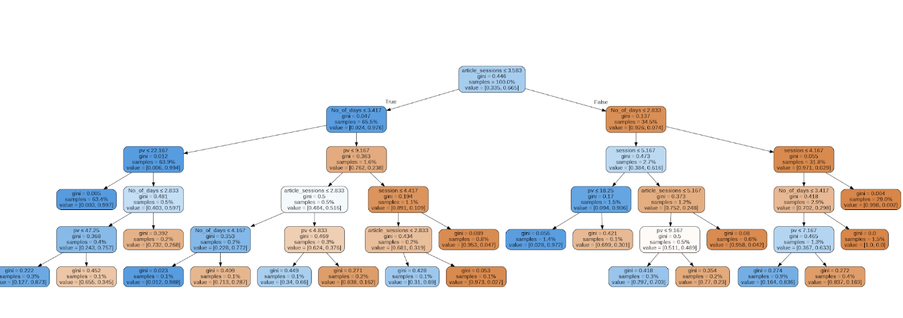
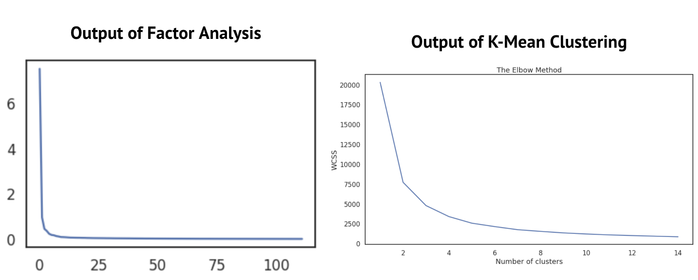
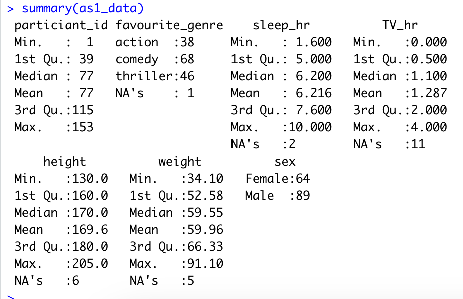
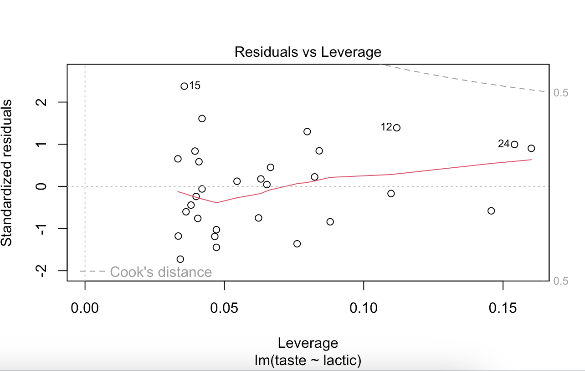

breadcrumb > You are viewing : Portfolio | [Click me to Conference-Community-Hackathon](/conference-community-hackathon.md) 

---

| Navigate To Anchor: |                                  |                                 |
| ------------------------------ | -------------------------------- | --------------------------------- |
| [AI Engineering](#ai-eng)       | [Machine Learning and Deep Learning](#mldl) | [DevOps/MLOps/Cloud](#Ops-cloud) |
| [GIS](#gis)                     | [Statistical Analysis](#stat-analysis) | [Programming Language Proficiency](#programming-lang) |

---
# Data Analytics and Visualisation 

### 1. Reporting for 2021-2023 on Community Services within the City of Whyalla

Analyzing and presenting council-based analytics summaries on community services and information demands offers valuable insights into the social and demographic needs of a council. This information empowers informed decision-making by identifying service gaps, ensuring equitable distribution, and facilitating the effective sharing of community grants, resources, and assets. The result is an enhancement in support systems and overall outcomes for the entire community.

View the PowerBI dashboard of Whyalla 2022-2023 at [this external link](https://app.powerbi.com/view?r=eyJrIjoiMGU2NDEzNzAtOWZlMy00YzcyLWE5ZjMtNTAzZWYxN2MyYmIxIiwidCI6IjUwY2UwYzQ2LWNmMjctNDQwZi04YWQ3LWY5YzBiOGJmNmQyZiIsImMiOjEwfQ%3D%3D) 
View [my experience](https://sacommunity.org/node/1081) at Infoxchange

---
### 2. E-commerce Optimization - AB Testing

Spearheaded the enhancement of online sales and user experience as a data analyst/statistician, managing GA4 implementation, AB testing, and data analytics, resulting in a remarkable ~15% increase in conversion rates. Additionally, implemented sophisticated e-commerce tracking to meticulously monitor and optimize product performance.

View [the pdf of one of the winner analysis on rearranging tabs product anchor experiment](pdf/Winner_Analysis_AB_Test 8_Rearranging_tabs _ Product Anchor_on_PDP.pdf)

---
### 3. User Journey and Engagement Study

As the sole analyst and engineer, I independently implemented GA4 and conducted data modelling, extract-load-tranform (ELT) and metrics such as exit rate, view item rate, contributing % in new users, bounce rate, etc. to understand user behavior and enhance content engagement. Achievements include the proficient utilization of custom dimensions for detailed product/web analytics and a 20% improvement in engagement metrics through data-driven UI/UX adjustments. My expertise spans GA4 implementation, event tracking, audience segmentation, data warehouse management, and integration with platforms like Google BigQuery.

Check out the code [here](https://github.com/camillekokoko/GA4)

---
### 4. SEO 

Throughout my role as a Reporting and Data Analyst, I excelled in optimizing SEO strategies and producing automated daily reports to meticulously measure and enhance overall performance. Achieved notable improvements in website visibility, engagement, and key performance indicators, contributing to data-driven decision-making processes.

---
# AI Engineering 

### 1. Leveraging large language model with domain adaptation: enhancing community directories with deep learning text summarization for machine-readable cataloging (MARC) standard description notes

This research project, conducted as part of my Master's program in AI and Machine Learning at the University of Adelaide, explores the integration of state-of-the-art technologies such as BERT, PyTorch, and Large Language Models (LLM), domain adaptation in the field of AI engineering and Natural Language Processing (NLP).  The focus is on optimizing community directories, particularly utilizing the SAcommunity open data database with around 14,500 records, by generating MARC standard description notes for the new summary field in the directory using deep learning-based text summarization.

Python and PyTorch served as the primary languages, complemented by SQL for database integration and Java for specific functionalities. Utilizing a streamlined software engineering workflow, I employed Git for version control, Docker for containerization, and database integration to manage data effectively. The project included building a seamless pipeline for data extraction and deploying the model to the web, showcasing the intersection of AI engineering and software development. 

  <iframe
    style="position: absolute; top: 0; left: 0; width: 100%; height: 100%;"
    src="https://www.youtube.com/embed/srKsCCE_l8Y?si=bRf246c0yIeZPqer"
    title="YouTube video player"
    frameborder="0"
    allow="accelerometer; autoplay; clipboard-write; encrypted-media; gyroscope; picture-in-picture; web-share"
    allowfullscreen
  ></iframe>

<a href="https://github.com/camillekokoko/exBERTSum">View exBERTSum's Code on GitHub</a> 
<a href="https://github.com/camillekokoko/exBERT">View exBERT's Code on GitHub</a>

---
---
# Machine Learning and Deep Learning 

### 1. Optimizing User Personas in Newspapers: A Machine Learning Approach with K-means and Random Forest Models

As a Data Analyst, I skillfully employed both claimed and observed data to derive valuable insights and inform decision-making processes in marketing, advertising, content planning, and other related domains. This approach ensured a comprehensive understanding of user behavior and preferences for effective strategy implementation.

---
### 2. Explainable AI with Shapley values

View code [here](https://github.com/camillekokoko/SHAP_horse_racing)

---

### 3. Image Classification

This project aims to investigate image classification using the CIFAR-10 dataset, employing two popular deep-learning architectures: ResNet50 and VGG16.

Check out [code](https://github.com/camillekokoko/Computer_Vision/tree/main/Image_Classification)

---
### 4. Deep learning
Check out [code](https://github.com/camillekokoko/Deeplearning)

---
### 5. RNN
Check out [code](https://github.com/camillekokoko/RNN)

---
### 6. Precision Small Object Detection in Real-Life Applications using Fasterrcnn_resnet50_fpn and SSD300_vgg16 Algorithms

This is one of the computer vision I have done during my research and pursuit of a master's degree in AI and machine learning. The project utilized algorithms with a primary focus on enhancing precision in detecting small objects within real-world contexts. The implementation showcased a robust and efficient solution, achieving high accuracy in object detection for improved practical applications. Notable features include the integration of the ResNet50 backbone network and Feature Pyramid Network (FPN) in Fasterrcnn_resnet50_fpn for efficient and accurate detection. Additionally, SSD300_vgg16 employed a Single Shot Multibox Detector (SSD) with a VGG16 backbone, ensuring real-time object detection across diverse scenarios.

    <iframe 
        style="position: absolute; top: 0; left: 0; width: 100%; height: 100%;" 
        width="560" 
        height="315" 
        src="https://www.youtube.com/embed/zJcAJ5dtSuc?si=jLGDZtHkqDHgYqVP" 
        title="YouTube video player" 
        frameborder="0" 
        allow="accelerometer; autoplay; clipboard-write; encrypted-media; gyroscope; picture-in-picture; web-share" 
        allowfullscreen
    ></iframe>

Check out the [code](https://github.com/camillekokoko/Computer_Vision/blob/main/Concepts_AI_5mins_video_code.ipynb)

---
---
# DevOps/MLOps/Cloud 

### 1.[Database](https://github.com/camillekokoko/Database) 
### 2.[Data Structures and Algorithms](https://github.com/camillekokoko/Data_Structures_Algorithms) 
### 3.[Cloud Engineering on AWS EC2 and Docker](https://github.com/camillekokoko/AWS_EC2_Docker) 
### 4.[Airflow](https://github.com/camillekokoko/airflow-tutorial) 

---
---
# Geographic Information System (GIS) 

---
---

# Statistical Analysis 

View Code [here](/survey.R/Statistical_Modelling_n_Inference_1.R) 
View Code [here](/survey.R/anova.R) 

View Code [here](/survey.R/model_selection.R) 

---
---
# Programming Language Proficiency 

### 1. [C# Programming](https://github.com/camillekokoko/C_sharp) 

### 2. [Java Programming](https://github.com/camillekokoko/java_lang) 

### 3. [C Programming](https://github.com/camillekokoko/C_lang_picsine) 

### 4. [Django - python web framework](https://github.com/camillekokoko/my-first-blog)  

---

|  Navigate To Anchor:                                |                                      |                                    |
|--------------------------------------|--------------------------------------|------------------------------------|
| [Statistical Analysis](#stat-analysis)| [Geographic Information System (GIS)](#gis) | [DevOps/MLOps/Cloud](#Ops-cloud)  |
| [Machine Learning and Deep Learning](#mldl)| [AI Engineering](#ai-eng)          | [Data Analytics and Visualization](#analytics-visual) |

---
breadcrumb > You are viewing : Portfolio | [Click me to Conference-Community-Hackathon](/conference-community-hackathon.md) 

---

Page template forked from <a href="https://github.com/evanca/quick-portfolio">evanca</a>

<!-- Remove above link if you don't want to attribute -->
