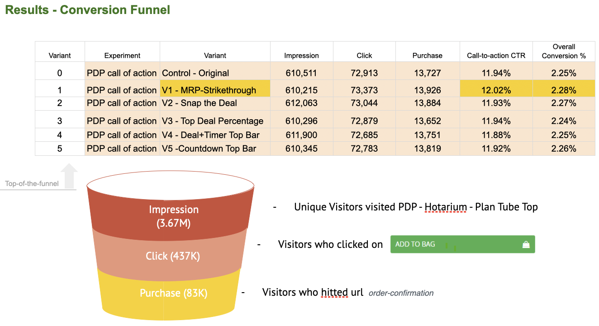

breadcrumb > You are viewing : Portfolio | [Click me to Tech Community](/Community.md) | [Click me to Hackathon](/Hackathon.md)

---
# Data Analytics and Visualisation

### 1. Reporting for 2021-2023 on Community Services within the City of Whyalla

Analyzing and presenting council-based analytics summaries on community services and information demands offers valuable insights into the social and demographic needs of a council. This information empowers informed decision-making by identifying service gaps, ensuring equitable distribution, and facilitating the effective sharing of community grants, resources, and assets. The result is an enhancement in support systems and overall outcomes for the entire community.

View the PowerBI dashboard of Whyalla 2022-202 at [this external link](https://app.powerbi.com/view?r=eyJrIjoiMGU2NDEzNzAtOWZlMy00YzcyLWE5ZjMtNTAzZWYxN2MyYmIxIiwidCI6IjUwY2UwYzQ2LWNmMjctNDQwZi04YWQ3LWY5YzBiOGJmNmQyZiIsImMiOjEwfQ%3D%3D) 
View [my experience](https://sacommunity.org/node/1081) at Infoxchange

---
### 2. E-commerce Optimization - AB Testing

Spearheaded the enhancement of online sales and user experience as an Analytic Engineer, managing GA4 implementation, AB testing, and data analysis, resulting in a remarkable 15% increase in conversion rates. Additionally, implemented sophisticated e-commerce tracking to meticulously monitor and optimize product performance.

View [the pdf of one of the winner analysis on rearranging tabs product anchor experiment](pdf/Winner_Analysis_AB_Test 8_Rearranging_tabs _ Product Anchor_on_PDP.pdf)

### [User Journey and Engagement Study]

As the sole analyst and engineer, I independently implemented GA4 and conducted comprehensive data analysis and metrics such as exit rate, view item rate, contributing % in new users, bounce rate, etc. to understand user behavior and enhance content engagement. Achievements include the proficient utilization of custom dimensions for detailed content analysis and a 20% improvement in engagement metrics through data-driven content adjustments. My expertise spans GA4 implementation, event tracking, audience segmentation, data analysis, and integration with platforms like Google BigQuery.

View [code](https://github.com/camillekokoko/GA4)

---
# AI Engineering

[EPA as a Predictor](/pdf/Lundeen_Final_Paper.pdf)
<iframe width="560" height="315" src="https://www.youtube.com/embed/srKsCCE_l8Y?si=bRf246c0yIeZPqer" title="YouTube video player" frameborder="0" allow="accelerometer; autoplay; clipboard-write; encrypted-media; gyroscope; picture-in-picture; web-share" allowfullscreen></iframe>

  
Expected Points is an equivalence metric for American Football that has been around since the 1960's and was reborn in the 2000's. In this project, 
I utilize the nflfastR data set, along with the ggplot2 and tidyverse packages to perform a regression analysis on the the data to determine what 
statistics most highly correlate to Expected Points Added and look at any predictive value of the models.
  

 
<a href="https://github.com/camillekokoko/exBERTSum">View exBERTSum's Code on GitHub</a> 
<a href="https://github.com/camillekokoko/exBERT">View exBERT's Code on GitHub</a>

---
# Machine Learning and Deep Learning
-[Explainable AI with Shapley values](https://github.com/camillekokoko/SHAP_horse_racing) 
-[Computer Vision](https://github.com/camillekokoko/Computer_Vision) 
-[Deeplearning](https://github.com/camillekokoko/Deeplearning) 
-[RNN](https://github.com/camillekokoko/RNN) 
-[Small Object Detection](https://github.com/camillekokoko/Computer_Vision/blob/main/Concepts_AI_5mins_video_code.ipynb) 

<iframe width="560" height="315" src="https://www.youtube.com/embed/zJcAJ5dtSuc?si=jLGDZtHkqDHgYqVP" title="YouTube video player" frameborder="0" allow="accelerometer; autoplay; clipboard-write; encrypted-media; gyroscope; picture-in-picture; web-share" allowfullscreen></iframe>

---
# DevOps/MLOps/Cloud

-[Database](https://github.com/camillekokoko/Database) 
-[Data Structures and Algorithms](https://github.com/camillekokoko/Data_Structures_Algorithms) 
-[Cloud Engineering on AWS EC2 and Docker](https://github.com/camillekokoko/AWS_EC2_Docker) 
-[Airflow](https://github.com/camillekokoko/airflow-tutorial) 

---
# Programming Language Proficiency

-[C_sharp](https://github.com/camillekokoko/C_sharp) 
-[Java](https://github.com/camillekokoko/java_lang) 
-[C](https://github.com/camillekokoko/C_lang_picsine) 
-[Django](https://github.com/camillekokoko/my-first-blog) 

---

 
<a href="https://github.com/camillekokoko/Coursera_Machine_Learning_Project">View Code on GitHub</a>

   

---
breadcrumb > You are viewing : Portfolio | [Click me to Tech Community](/Community.md) | [Click me to Hackathon](/Hackathon.md)

---

Page template forked from <a href="https://github.com/evanca/quick-portfolio">evanca</a>

<!-- Remove above link if you don't want to attribute -->
